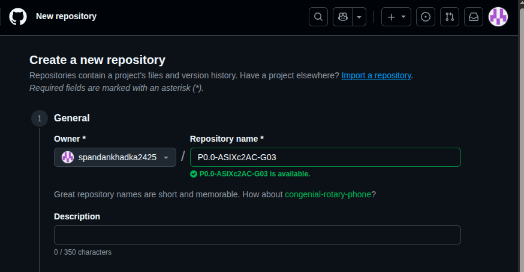
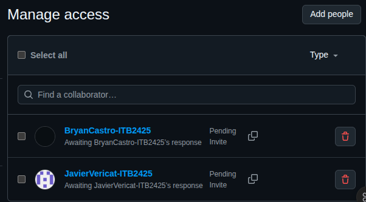

# Creación del Repositorio Git

A continuación se muestran los pasos para crear un repositorio Git y realizar el primer commit.

## 1. Inicializar el repositorio

Primero, accedemos a la carpeta del proyecto y ejecutamos el comando para inicializar el repositorio Git.

*En esta imagen (rep1.png) se puede ver cómo se ejecuta el comando `git init` para crear un nuevo repositorio en la carpeta actual.*

## 2. Añadir archivos y realizar el primer commit

Después, añadimos los archivos al área de preparación (staging area) y realizamos el primer commit.

*En la imagen (rep2.png) se observa cómo se utilizan los comandos `git add .` para añadir todos los archivos y `git commit -m "Primer commit"` para guardar los cambios en el repositorio.*
